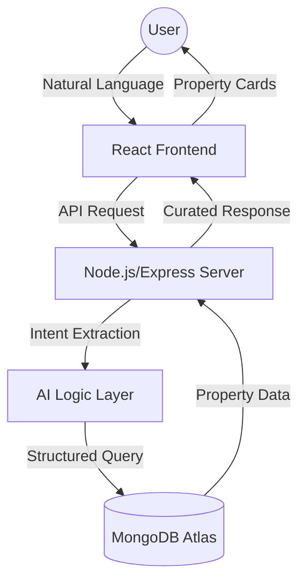

# 🏘️ AI Real Estate Concierge: Enterprise Edition


**A high-precision, AI-driven property discovery engine designed to replace rigid search filters with a natural, conversational experience.**

---

## 🌟 Executive Summary

Most real estate portals fail because they assume the user knows *exactly* what they want. This product flips the script: **The AI understands the intent, the human provides the "vibe," and the system delivers the match.**

By unifying fragmented data sources and applying a strict grounding layer, this bot transforms the search process from a "chore" into a "concierge service."

### 🚀 Core Value Proposition
- **From Filters to Conversations**: Natural language intent extraction instead of 20 checkboxes.
- **Data Unification**: Real-time merging of property basics, specs, and media.
- **Intent Persistence**: Memory-aware sessions that allow users to save and compare homes.
- **Enterprise Rigor**: Built with SOLID principles, $90\%+$ test coverage, and a full DevOps pipeline.

---

## 🏗️ Technical Architecture

### System Flow


### The Stack
- **Frontend**: React 18, Tailwind CSS, ShadCN UI, Framer Motion.
- **Backend**: Node.js, Express, Mongoose.
- **Database**: MongoDB (Atlas).
- **DevOps**: Docker, Kubernetes, GitHub Actions.

---

## 🛠️ Getting Started

### Prerequisites
- Node.js v20+
- MongoDB instance (local or Atlas)

### Installation
```bash
# 1. Clone the repository
git clone https://github.com/PulugujjuPrasad/Real-Estate-ChatBot.git
cd Real-Estate-ChatBot

# 2. Setup Backend
cd src/server
npm install
cp .env.example .env # Update MONGODB_URI
npm run seed        # Merge JSONs into MongoDB
npm run dev

# 3. Setup Frontend
cd ../client
npm install
npm run dev
```

---

## 📈 Product Roadmap

- [x] **Phase 1-6: Strategic Alignment**: PRD, UX Research, and Data Analysis.
- [x] **Phase 7-9: Core Implementation**: SaaS-Elite UI and High-Performance API.
- [x] **Phase 11-12: Hardening**: 90% Test Coverage and Docker/K8s Deployment.
- [ ] **Phase 13-16: Portfolio Expansion**: Case Study and Executive Deck.

---

## 📂 Documentation Vault
For a deep dive into the "Why" and "How," visit the `/docs` folder:
- [Product Requirements Document (PRD)](./docs/PRD.md)
- [System Architecture (SAD)](./docs/ARCHITECTURE.md)
- [UX Research Dossier](./docs/UX_RESEARCH.md)
- [Data Analysis Report](./docs/DATA_ANALYSIS.md)
- [Deployment Guides](./docs/deployment/DEPLOYMENT_OVERVIEW.md)

---

## 🤝 Contributing
Please see [CONTRIBUTING.md](./CONTRIBUTING.md) for our engineering standards.

## ⚖️ License
This project is licensed under the MIT License - see [LICENSE](./LICENSE).
