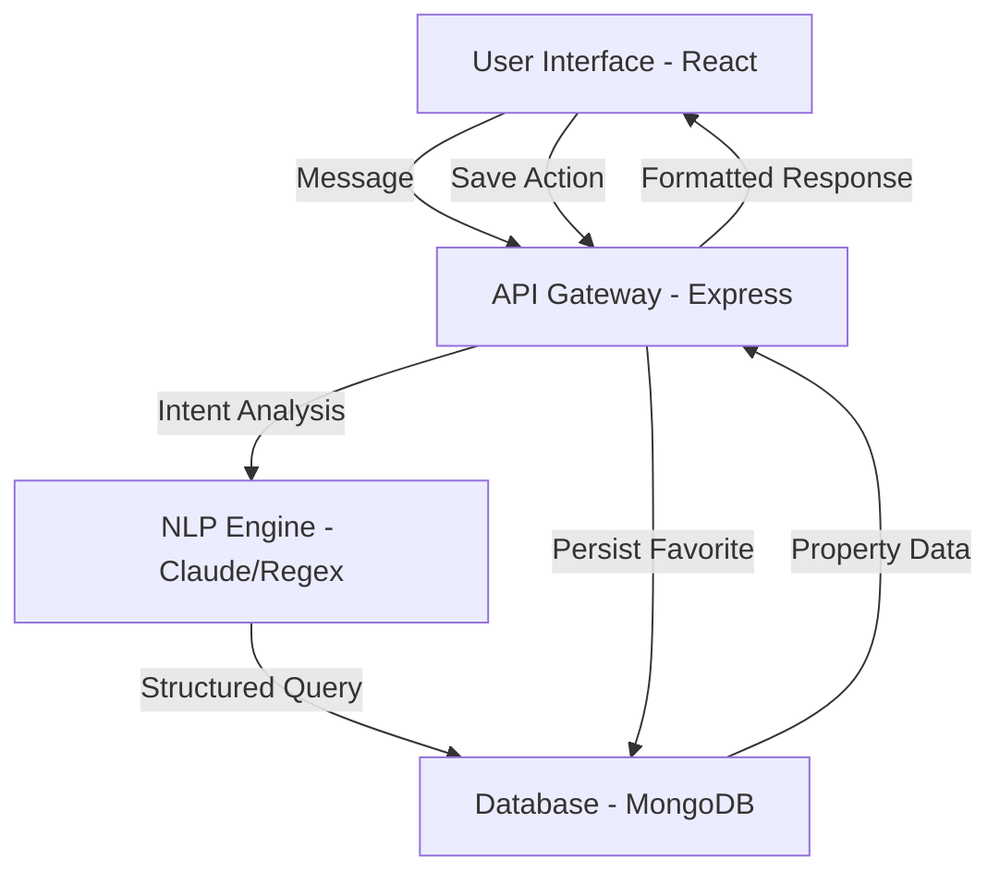

# SYSTEM ARCHITECTURE DOCUMENT (SAD)
**Project:** AI Real Estate Concierge (v1.0)
**Status:** Architectural Review
**Version:** 1.0.0
**Lead Role:** Principal Product Architect / Staff Software Engineer

---

## 1. Architectural Philosophy
The system is designed as a **Decoupled Intelligence Layer**. We separate the **Data Acquisition** (JSON merging), the **Business Logic** (Filtering/State), and the **Interaction Layer** (React Chat UI). This ensures that we can upgrade the AI model or change the database without rewriting the frontend.

---

## 2. Technical Stack (The Enterprise Choice)

| Component | Technology | Rationale |
| :--- | :--- | :--- |
| **Frontend** | React.js (v18+) | Industry standard for stateful UIs and component reusability. |
| **Backend** | Node.js + Express | Non-blocking I/O is critical for handling concurrent chat sessions. |
| **Database** | MongoDB Atlas | Flexible schema allows for rapid iteration on property characteristics. |
| **State Mgmt** | React Context + Backend Session | Maintains conversation flow and user preferences. |
| **Deployment** | Vercel (Frontend) / Render (Backend) | Optimized for CI/CD and rapid scaling. |

---

## 3. Data Architecture & Pipeline

### 3.1 The Merge Strategy (JSON $\to$ Unified Document)
Since the raw data is fragmented, we implement a **Synthesis Pipeline** during the database seeding phase.

**Merge Logic:**
$$\text{Property}_{Unified} = \text{Basics}(\text{id}) \cup \text{Characteristics}(\text{id}) \cup \text{Images}(\text{id})$$

**Target MongoDB Schema (`properties` collection):**
```json
{
  "_id": "ObjectId",
  "propertyId": "Number (from JSON)",
  "title": "String",
  "price": "Number",
  "location": "String",
  "specs": {
    "bedrooms": "Number",
    "bathrooms": "Number",
    "sizeSqft": "Number",
    "amenities": ["String"]
  },
  "media": {
    "imageUrl": "String"
  },
  "createdAt": "Date",
  "updatedAt": "Date"
}
```

---

## 4. API Design (The Contract)

The system uses a RESTful API to communicate between the React client and the Node server.

### 4.1 Endpoints

| Method | Endpoint | Description | Request Body | Response |
| :--- | :--- | :--- | :--- | :--- |
| `POST` | `/api/chat` | Process user message & return response. | `{ "message": "...", "sessionId": "..." }` | `{ "text": "...", "properties": [...] }` |
| `POST` | `/api/properties/save` | Save a property to user favorites. | `{ "propertyId": 123, "userId": "abc" }` | `{ "success": true }` |
| `GET` | `/api/properties/saved` | Retrieve all saved properties. | `{ "userId": "abc" }` | `[ { propertyData } ]` |
| `GET` | `/api/properties/compare`| Get specs for 2+ properties. | `?ids=1,2,3` | `[ { propertyData } ]` |

---

## 5. Conversation State Machine

To prevent the bot from "forgetting" user preferences, we implement a **State Transition Model**.

**States:**
1.  **IDLE**: Waiting for user greeting.
2.  **COLLECTING_PREFS**: Extracting Budget $\to$ Location $\to$ Bed/Bath.
3.  **MATCHING**: Querying DB and presenting results.
4.  **REFINING**: Handling follow-up questions (e.g., "Do any have a pool?").
5.  **SAVING**: User marks a property as favorite.

**Logic Flow:**
$\text{User Input} \rightarrow \text{NLP Intent Extractor} \rightarrow \text{Update Session State} \rightarrow \text{Execute DB Query} \rightarrow \text{Generate Response}$

---

## 6. System Flow Diagram (Mermaid)



---

## 7. Quality & Security Guardrails

- **Input Validation**: All user inputs are sanitized via `express-validator` to prevent NoSQL injection.
- **Strict Grounding**: The AI response layer is prohibited from inventing property data; it can only map result sets from MongoDB to natural language.
- **Error Handling**: A global error middleware catches 404s and 500s, returning a "friendly" bot failure message.
